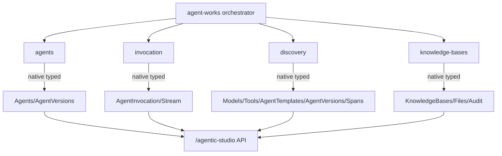

# Charlotte AI AgentWorks Skills

AI coding assistant skills for interacting with **Charlotte AI AgentWorks**. Build, manage, invoke, and optimize AI agents.

## Getting Started

### Prerequisites

- Python 3.14+
- FalconPy 1.6.6+ (auto-installed from PyPI)
- Falcon API OAuth 2.0 client credentials with scopes:
  - `charlotte-ai-agent-definition:read` — All read operations
  - `charlotte-ai-agent-definition:write` — All write operations

### Installation

#### Claude Code

**Prerequisites:** Claude Code CLI installed, Charlotte AI AgentWorks API credentials configured (see [Credentials](#credentials) below).

1. Add the marketplace:
   ```
   /plugin marketplace add https://github.com/CrowdStrike/agent-works-skills.git
   ```
   Verify: `/plugin marketplace list`
2. Install the plugin:
   ```
   /plugin install crowdstrike-agent-works@agent-works-marketplace
   ```
   Verify: `/plugin list`

**Updating:** refresh the marketplace, then reinstall to pick up the latest release:
```
/plugin marketplace update agent-works-marketplace
/plugin install crowdstrike-agent-works@agent-works-marketplace
```
Start a new Claude Code session to load the updated skills.

#### Codex

**Prerequisites:** Codex CLI installed, Charlotte AI AgentWorks API credentials configured.

1. Add the marketplace:
   ```
   codex plugin marketplace add \
     https://github.com/CrowdStrike/agent-works-skills.git
   ```
   Verify: `codex plugin marketplace list`
2. Install the plugin:
   ```
   codex plugin add \
     crowdstrike-agent-works@agent-works-marketplace
   ```
   Verify: `codex plugin list`

**Updating:** refresh the marketplace, then reinstall to pick up the latest release:
```
codex plugin marketplace upgrade agent-works-marketplace
codex plugin add \
  crowdstrike-agent-works@agent-works-marketplace
```
Start a new Codex thread to load the updated skills.

#### Local dev

```
claude --plugin-dir /path/to/agent-works-skills
```

### Credentials

Run `/crowdstrike-agent-works:setup` to configure credentials. The plugin supports two resolution methods:

1. **Env vars** (CI/overrides): `FALCON_CLIENT_ID`, `FALCON_CLIENT_SECRET`, `FALCON_BASE_URL`
2. **TOML profile**: `~/.cache/crowdstrike-agent-works/credentials.toml`

## Usage

Example prompts demonstrating the full skill set:

> Create a Charlotte AI AgentWorks agent called "Threat Hunter" that analyzes detections

> Invoke agent <agent-id> with prompt "Investigate suspicious PowerShell on host XYZ"

> Analyze agent <agent-id> for the last 7 days and suggest prompt improvements

The orchestrator skill routes requests to specialized skills based on intent, following a hub-and-spoke pattern.

## Skills

| Skill | Purpose |
|-------|---------|
| `agent-works` | Primary orchestrator — routes requests to specialized skills |
| `agents` | Agent lifecycle (create/update, query, publish, analyze) |
| `invocation` | Invoke agents, stream results, get messages, cancel, inspect traces |
| `knowledge-bases` | KB CRUD + file upload/download + audit (native FalconPy) |
| `discovery` | Query models, tools, templates, versions, spans (native FalconPy) |
| `setup` | Credential configuration |
| `foundry-redirect` | Points agent/KB requests for a Falcon Foundry app to the `crowdstrike-falcon-foundry` plugin |

## Architecture



**FalconPy Integration:**
- ✅ Native typed classes throughout: `Agents`, `AgentVersions` (agents); `AgentInvocation`, `Stream` (invocation, including cancel); `KnowledgeBases`, `KnowledgeBaseFiles`, `KnowledgeBaseAuditEvents` (knowledge-bases); `Models`, `Tools`, `AgentTemplates`, `Spans` (discovery)

## Use Cases

See **[docs/USE_CASES_VALIDATED.md](docs/USE_CASES_VALIDATED.md)** for validated security operations scenarios:

- Threat hunting agents with Falcon platform integration
- Incident response playbooks with knowledge base attachment
- Agent performance analysis and optimization
- Batch host investigations (ransomware campaigns)
- Trace-based debugging for tool failures

## Troubleshooting

### Authentication Issues

**`403 Forbidden`** — the API client is missing scopes. Grant both `charlotte-ai-agent-definition:read` and `charlotte-ai-agent-definition:write` in the Falcon console, then restart so a fresh token is fetched.

**Authentication fails** — verify credentials with:
```bash
python common/scripts/auth.py
```

### Feature Availability

**`404 Not Found` on agent CRUD** — Charlotte AI AgentWorks CRUD endpoints may be gated behind a feature flag in your cloud. Contact your CrowdStrike representative for enablement.

### Common Issues

See **[docs/TROUBLESHOOTING.md](docs/TROUBLESHOOTING.md)** for comprehensive issue resolution including:
- Span query filter syntax errors
- Tool call failures
- Invocation debugging
- FQL syntax validation

## Testing

Verify installation and credentials:

```bash
# Test authentication (all 4 FalconPy clients)
python common/scripts/auth.py

# Test knowledge base query (safe read-only)
cd skills/knowledge-bases
../../scripts/python.sh scripts/kb_search.py --limit 5

# Test agent query
cd ../agents
../../scripts/python.sh scripts/agent_search.py --limit 5
```

## OAuth 2.0 Scopes

The API uses a simplified 2-scope model. Both scopes cover all Charlotte AI AgentWorks resources (agents, invocations, knowledge bases, discovery):

| Scope | Operations |
|-------|-----------|
| `charlotte-ai-agent-definition:read` | • Agent queries and reads<br>• Invocation reads (get messages, stream)<br>• Discovery queries (models, tools, templates, versions, spans)<br>• Knowledge base queries and reads<br>• KB file queries, reads, and audit events |
| `charlotte-ai-agent-definition:write` | • Agent create/update/publish<br>• Agent invocation start/cancel<br>• Knowledge base create/update<br>• KB file upload/delete |

## Contributing

Contributions welcome! See [CONTRIBUTING.md](CONTRIBUTING.md) for the development workflow, and
[CODE_OF_CONDUCT.md](CODE_OF_CONDUCT.md) for our community standards.

## Support

See [SUPPORT.md](SUPPORT.md) for how to get help, and [SECURITY.md](SECURITY.md) to report a
security vulnerability.

## License

MIT — see [LICENSE](LICENSE)

---

**Additional Documentation:**

- **[docs/USE_CASES_VALIDATED.md](docs/USE_CASES_VALIDATED.md)** - Security operations scenarios with expected outputs
- **[docs/TROUBLESHOOTING.md](docs/TROUBLESHOOTING.md)** - Comprehensive issue resolution guide
- **[references/](references/)** - Technical references for Claude Code skills (FQL syntax, span constraints, developer guide)
